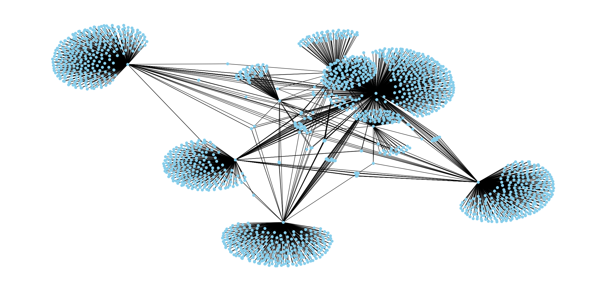
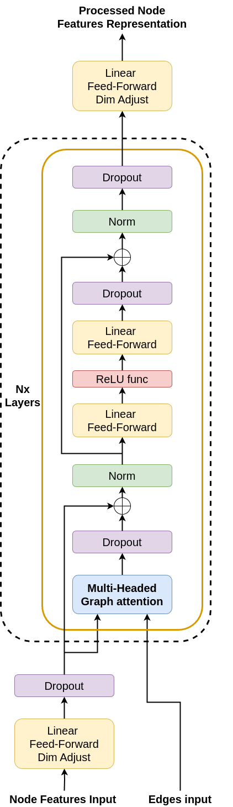

# Transformer-like GNN for Edge Prediction in Semantic Graphs


*Figure 1: A graph of 2000 nodes built from the root Wikipedia article 'Sustainability'.*

## 🚀 Project Overview

This project, developed for a Social Media analysis course in an AI/ML MSc program, explores the application of a custom-built, transformer-inspired Graph Neural Network (GNN) for edge prediction in semantic graphs. The core task was to investigate the prompt: *"Application of GNN on semantic graph generated by LLMs"*.

To tackle this, the project follows a "from-scratch" approach:
1.  **Dataset Creation:** A large-scale graph dataset was constructed from Wikipedia, where nodes are article titles and edges represent hyperlinks between them.
2.  **Custom GNN Architecture:** A novel deep neural network was designed, blending the principles of Graph Attention Networks (GATs) with the architectural patterns of the Transformer's encoder stack.
3.  **Training and Evaluation:** The model was trained for link prediction and evaluated using standard metrics, as well as a custom "Agnostic-AUC" to measure its ability to capture semantic similarity independent of the explicit graph structure.

The goal is to demonstrate the effectiveness of this architecture in capturing complex relationships within the graph and to analyze its capabilities and limitations, particularly concerning semantic understanding versus structural link prediction.

## ✨ Key Features

*   **Custom GNN Architecture:** A deep GNN model inspired by Transformer encoders, utilizing multi-head graph attention, residual connections, and layer normalization.
*   **Large-Scale Graph Dataset:** A custom dataset of 389 graphs, each with up to 20,000 nodes, built by crawling Wikipedia articles. Totaling approximately 7 million nodes.
*   **Node Embeddings:** State-of-the-art `all-MiniLM-L6-v2` sentence-transformer model to generate 384-dimensional vector embeddings for all article titles (nodes).
*   **Advanced Evaluation:** Introduction of the **Agnostic-AUC (A-AUC)** metric to evaluate the model's ability to predict links based on pure semantic similarity (cosine similarity of node embeddings) versus the learned graph structure.
*   **Real-Case Application:** The trained model is tested on edge-less graphs generated by an LLM (Llama 3.2 3B) to assess its generalization capabilities on unseen, domain-related, and non-domain-related node sets.

## 📂 Repository Structure

```
/
├─── custom_logger/      # Python logging configuration.
├─── dataset_builder_wiki/ # Scripts to build the Wikipedia graph dataset.
│    ├─── create_dataset_main.py   # Main script for dataset generation.
│    ├─── wiki_crowler_bfs.py      # BFS algorithm for crawling Wikipedia links.
│    └─── wikipedia_articles.txt   # List of root articles for graph generation.
├─── gnn_networks/         # GNN models, training scripts, and outputs.
│    ├─── gnn_model_v1/     # Final GNN model architecture.
│    ├─── trainer.py        # Script for training and evaluating the GNN.
│    ├─── model_dumps/      # Saved model weights (.pth files).
│    ├─── metric outputs/   # Training/testing metrics in JSON format.
│    └─── plots/            # Plots for loss, AUC, and A-AUC.
├─── graph_metrics/        # Scripts and data for graph metrics analysis.
├─── images/               # Images used in this README.
├─── latex/                # LaTeX source for the detailed project report.
├─── llm_dataset/          # Scripts and datasets for the LLM-based real-case application.
├─── requirements.txt      # Project dependencies.
└─── README.md             # This file.
```

## 📊 Dataset: Wikipedia Articles Link Graph

The dataset was constructed to train and evaluate the GNN.

*   **Graph Extraction:** A Breadth-First Search (BFS) algorithm was implemented to crawl Wikipedia, starting from a list of root articles. Each graph is expanded to a maximum of 20,000 nodes. The BFS approach ensures a robust representation of the root article's immediate neighborhood.
*   **Node Representation:** Each node, representing a Wikipedia article title, is converted into a 384-dimensional numerical vector using the `all-MiniLM-L6-v2` sentence-transformer model. This allows the GNN to process the semantic meaning of the nodes.
*   **Dataset Composition:** The final dataset consists of 389 graphs, primarily focused on "sustainability and development" topics, but also including the top 50 most visited Wikipedia articles of 2024 to encourage generalization. The data is stored in both JSON format and pre-processed PyTorch tensor files for efficient loading.

## 🤖 Model Architecture: Transformer-like GNN

The network architecture was designed to be deep enough to capture long-range dependencies in large graphs, drawing inspiration from the highly successful Transformer model in NLP.

The model consists of a stack of custom `DeepGATBlock` modules. Each block processes node embeddings through a series of operations analogous to a Transformer encoder layer:

1.  **Multi-Head Graph Attention:** A GAT layer learns the importance of neighboring nodes. The outputs of the heads are averaged, not concatenated, to maintain dimensionality.
2.  **Residual Connection & Normalization:** A residual connection adds the input of the GAT layer to its output, followed by Layer Normalization.
3.  **Feed-Forward Network:** A standard two-layer feed-forward network with a ReLU activation in between.
4.  **Second Residual Connection & Normalization:** Another residual connection and Layer Normalization step.

The final model uses 4 levels of `DeepGATBlock`, with 2 attention heads per layer and a hidden dimension of 128. A high dropout rate of 0.75 is used to prevent overfitting in this deep architecture.


*Figure 2: A graphical representation of the GNN's core building block.*

## ⚙️ Training and Evaluation

*   **Task:** Supervised link prediction.
*   **Procedure:** The model is trained to distinguish between existing edges (positive samples) and a random sample of non-existing edges (negative samples).
*   **Loss Function:** `BCEWithLogitsLoss` is used, which combines a Sigmoid activation and Binary Cross-Entropy loss for efficient and stable training.
*   **Optimizer:** AdamW, a variant of Adam that decouples weight decay from the gradient update.
*   **Metrics:**
    *   **AUC (Area Under the Curve):** Measures the model's ability to correctly classify positive and negative edges.
    *   **A-AUC (Agnostic-AUC):** A custom metric designed to evaluate the model's grasp of semantic similarity. It measures the AUC between the model's predicted edge probabilities and a ground truth derived from the cosine similarity of the initial node embeddings (where similarity > 0.7 implies an edge). This tests if the model can predict links between semantically similar nodes, even if they weren't connected in the training data.

## 📈 Main Findings

The experiments yielded several key insights:

1.  **High Performance on Link Prediction:** The model quickly learns to predict links with high accuracy, achieving an **AUC of over 0.92** on the test set. This confirms the architecture is effective for the link prediction task on this dataset.
2.  **Semantic Similarity vs. Graph Structure:** The A-AUC metric revealed a crucial finding. As the model's training progressed and its standard AUC improved, its **A-AUC score consistently decreased**. This indicates that the model learned to prioritize the graph's explicit link structure over the pure semantic similarity of the nodes.
3.  **The Nature of Wikipedia Links:** The divergence between AUC and A-AUC leads to a significant conclusion: **links between Wikipedia articles are not based solely on semantic closeness**. For example, the "Sustainability" page links to the "Venn diagram" page—a structural or contextual link, not a semantically similar one. The GNN correctly learns these non-semantic relationships.
4.  **Diminishing Returns:** Increasing the training set size from 40 to 315 graphs yielded only a minor improvement in AUC (0.900 to 0.927), suggesting that a smaller, representative dataset is sufficient for the model to learn the underlying patterns.

## 💡 Real-Case Application & Limitations

To test generalization, the trained model was used to predict edges for two graphs of 100 nodes each, generated by an LLM. One graph was domain-related (sustainability), and the other was not (medicine).

*   **Findings:** The model successfully predicted a dense, coherent graph for the sustainability-related nodes. However, for the medicine-related nodes, it struggled to find connections and the core of the predicted graph still revolved around sustainability-related concepts.
*   **Conclusion:** This demonstrates that while the model is powerful, it **specializes in the domain of its training data** and does not generalize well to entirely different topics.

## 📚 Frameworks and Libraries

This project leverages several key open-source frameworks for machine learning and data processing:

*   [**PyTorch**](https://pytorch.org/): The core deep learning framework used to build and train the neural network.
*   [**PyTorch Geometric (PyG)**](https://pytorch-geometric.readthedocs.io/en/latest/): An extension library for PyTorch for implementing Graph Neural Networks.
*   [**Sentence-Transformers**](https://www.sbert.net/): A framework for state-of-the-art sentence, text, and image embeddings. Used here for generating node embeddings from Wikipedia article titles.
*   [**Hugging Face Transformers**](https://huggingface.co/docs/transformers/index): Provides the underlying architecture for the sentence-transformer model.

## 🛠️ How to Use

This repository contains all the code and data needed to reproduce the experiments.

1.  **Install Dependencies:**
    ```bash
    pip install -r requirements.txt
    ```
2.  **Build Dataset (Optional):**
    The pre-built dataset is included. To generate it from scratch, run the main script from the `dataset_builder_wiki` directory. This will create the JSON and then the tensor datasets.
    ```bash
    python dataset_builder_wiki/create_dataset_main.py
    ```
3.  **Train the Model:**
    Use the `trainer.py` script in `gnn_networks/`. The main execution block trains two versions of the model sequentially (V1 and V2). You can modify the `if __name__ == "__main__"` block in the script to train only a specific version.
    ```bash
    python gnn_networks/trainer.py
    ```
4.  **Evaluate:**
    The trainer script handles both training and evaluation, saving metrics and plots to the `gnn_networks/` subdirectories.
